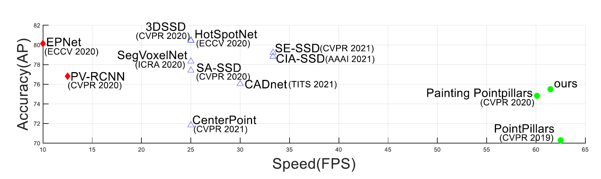
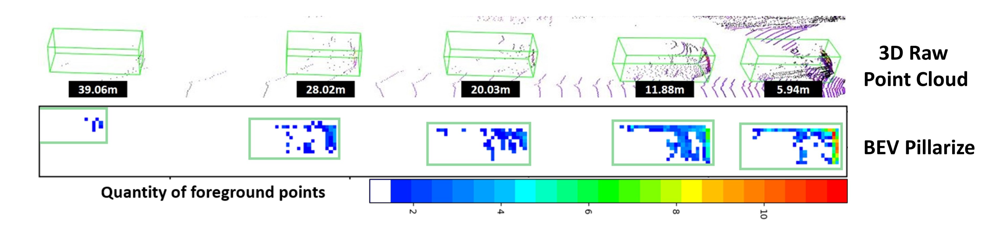
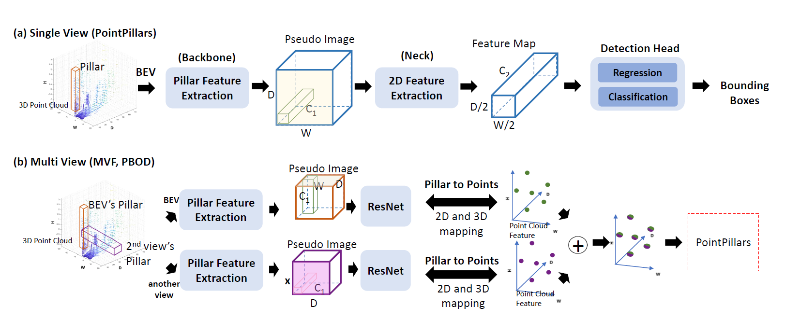
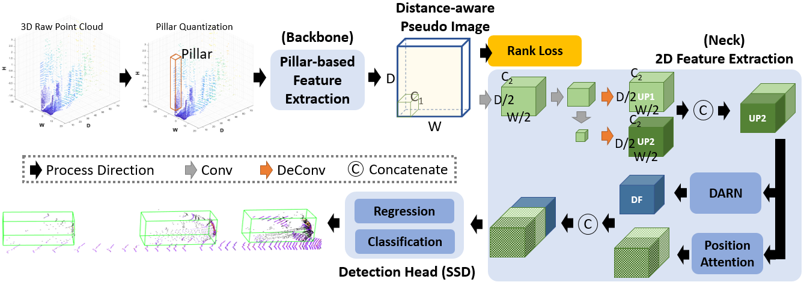
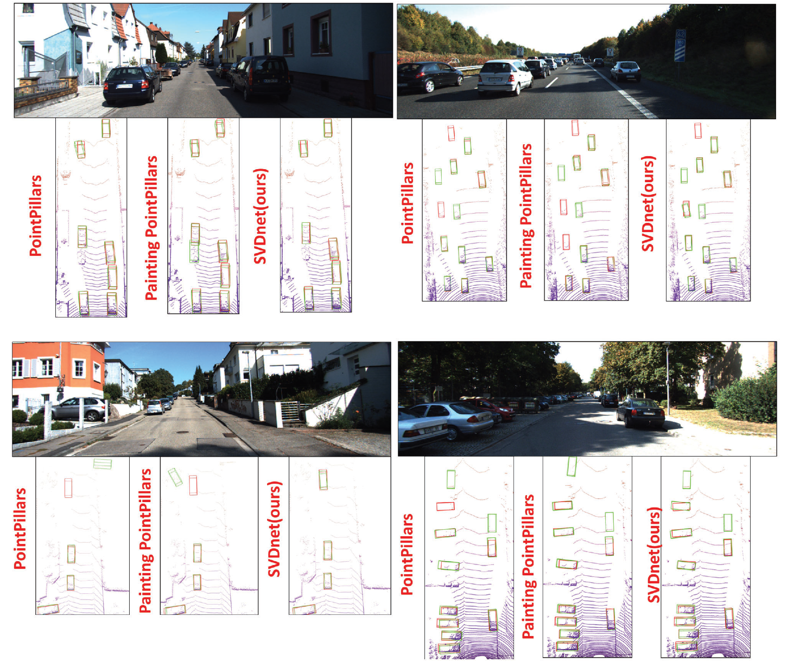
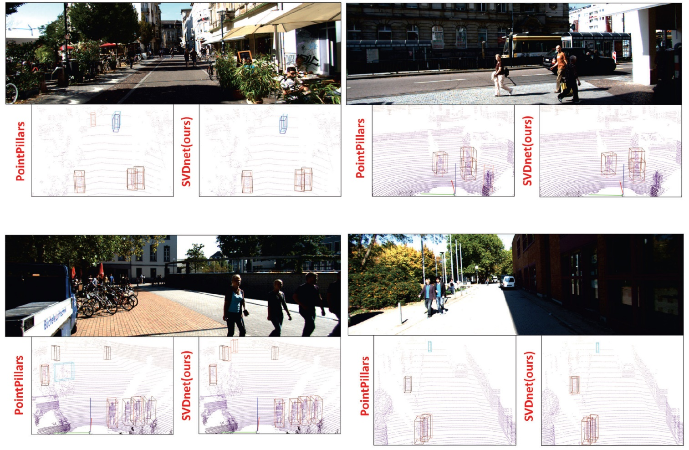

# SVDNET: SINGULAR VALUE CONTROL AND DISTANCE ALIGNMENT FOR LIDAR-BASED 3D VEHICLE DETECTION

- [SVDNET: SINGULAR VALUE CONTROL AND DISTANCE ALIGNMENT FOR LIDAR-BASED 3D VEHICLE DETECTION](#svdnet-singular-value-control-and-distance-alignment-for-lidar-based-3d-vehicle-detection)
  - [Note](#note)
  - [Demo on KITTI dataset](#demo-on-kitti-dataset)
  - [Abstract](#abstract)
  - [Challenge](#challenge)
  - [Related Works](#related-works)
  - [Proposed Method](#proposed-method)
  - [Experimental Results](#experimental-results)
  - [Reference](#reference)
  - [Usage](#usage)
  - [Create data setting](#create-data-setting)
  - [Files about SVDnet (directly)](#files-about-svdnet-directly)

## Note
- Init this repository from 2021 graduated CHEN CHIH JEN project.
<!-- - In the OpenPCDet_ros repository(2022 graduated CHANG MING JEN), there is related code. (./pcdet/models/necks) -->

## Demo on KITTI dataset

https://github.com/nycu-acm/SVDNet/assets/55246608/306077e9-c61d-4624-949e-47874d814458

https://github.com/nycu-acm/SVDNet/assets/55246608/081575a9-58f4-4b5e-ae19-9bd3e92e180b

https://github.com/nycu-acm/SVDNet/assets/55246608/c8fd7e25-c470-4d4a-a3dc-0ce0b6457747

## Abstract
Nowadays, state-of-the-art (SOTA) LiDAR-based 3D object detection proposed voxelization or pillarization to regularize unordered point clouds and significantly improve computing efficiency. However, accuracy is traded for better efficiency. Thus, we ask a practical question and bring up a new problem setting: “Is it possible to keep high detection accuracy while pillarization is applied to maximize efficiency?”. To this end, we found the inconsistent sparsity of the point cloud over the depth distance, which is still an open question, might be the main reason. To address the inconsistency effect for 3D vehicle detection, a new pillar-based vehicle detection model, named SVDnet, is proposed. First, we proposed a novel low-rank objective that forces the backbone to extract distance/sparsity-aware vehicle features and suppress feature variations. Next, in the neck, we alleviated the remaining feature inconsistency with the help of a Distance AlignmentRatio generation Network (DARN) and a position attention network. Finally, the derived features, less sensitive to sparsity, are inputted to an SSD-like detection head for vehicle detection. Compared with the SOTA pillar-based methods, SVDnet improves the average precision and keeps high computational efficiency (i.e., FPS≥60).

The system performances (in in terms of Accuracy and Speed in KITTI dataset) of SOTA LiDAR-based 3D object detection methods are shown. We use three types of markers with different colors to present three categories whose FPS’s are less than 20, between 20 and 35, and greater than 60 respectively. The methods that apply quantization in the 3D space generally have more advantages of practicality owing to their better balance between accuracy and speed.

## Challenge

Due to the intrinsic property of LiDAR, the number of points decreases dramatically over the distance, as shown in the figure above. It may result in inconsistent representations of the distant vehicles with the near ones. The sparsity inconsistency property of a point cloud mentioned above leads to distance-dependent feature variations even for the same-class objects. The feature variations due to inconsistent sparsity and other undesired interference eventually go against the stable target representations that a robust detector favors.

## Related Works
3D object detection methods can be categorized based on how they represent or aggregate the basic unit features from the point cloud. First, point-based 3D object detection methods extract features for every point. It makes these methods more time-consuming than the others. PointRCNN[5] uses the point features to classify foreground and background points. It inputs foreground points into the proposal generation module in the first stage and refines the rough bounding boxes in the second stage. STD[6] proposes the sparse-to-dense method to achieve better proposal refinement. 3DSSD[7] is faster than most related point-based works due to the new sampling strategy. It combines Distance-FPS and Feature-FPS to remove time-consuming feature propagation layers.

Secondly, voxel-based methods, which voxelized the point cloud, are faster than most point-based ones at the expense of the resolution. For example, Fast Point R-CNN[8] applies 3D convolution on the voxels to extract features. Its RefinerNet utilizes both the raw point cloud and the extracted contextual features with an attention mechanism to achieve better performance. Similarly, Hotspots[9] does the same process as [8] first. Then, the model additionally applies these feature maps to predict 3D bounding boxes and hotspots simultaneously. To solve the imbalance density problem of the point cloud, SIENet[10] proposed a spatial information enhancement module to predict the dense shapes of point sets and improve the feature representations. The predicted complete shapes can alleviate the sparse issues, especially for distant objects. However, this enhancement module will result in a speed drop.

Third, pillar-based methods, similar to voxel-based approaches but compress the height dimension information, are the fastest among the three categories. PointPillars [1], which can achieve 62 FPS on KITTI[3] benchmarks, treats the pillar feature maps extracted from PointNet[2] as a pseudo image and applies similar methods for 2D object detection to the pseudo image. The main structure of PointPillars is shown in the figure below.

Its three main blocks, the pseudo image generation, 2D feature extraction, and detection head, lay the groundwork for its successors, such as MVF[11] and PBOD[12]. As successors, MVF[11] and PBOD[12] extract the pillar-wise features from not only the bird’s eye view but also the perspective view. A pillar-to-point projection strategy, which maps between 2D pseudo images and 3D point cloud, was used, and a modified detection head is proposed to improve the detection accuracy. Their experimental results show that the fusion of a perspective view via cylindrical projection and the bird’s eye view can achieve better detection at the cost of inference time. Instead of applying another auxiliary view, LiDAR R-CNN[13] and CenterPoint[14] try to improve PointPillar[1] by enhancing the detection head. LiDAR R-CNN[13] proposed a second-stage detector to refine the preliminary results in a plug-and-play manner. It not only utilizes the point-based R-CNN approach to achieve high precision and real-time performance but also mitigates the size ambiguity by several solutions such as boundary offset and virtual points. CenterPoint[14] further introduced a novel center-point-based detector which finds object centers from bird-eye-view features first and then regresses and refines them. Unlike the conventional anchor-based detector, the center point detector is a more appropriate proxy of a free-form 3D object. However, none of these methods target the sparsity imbalance issue in LiDAR-based point clouds.

## Proposed Method

As a pillar-based method, we applied PointPillars [1] as the backbone to project the LiDAR points to bird’s eye view (BEV) and divide the 2D view into several pillars. Next, PointNet [2] is utilized to extract features for each pillar and generate a pseudo image. Finally, the pseudo image goes through CNN to acquire two feature maps of different scales and they are upscaled to the same size, denoted as UP1 and UP2, which are concatenated together before being sent to the detection module. To acquire more generalizable features for better detection performance, we introduce the rank loss on the pseudo image and plug the DARN module as well as position attention into the multi-scale feature extraction layer.

## Experimental Results

Visualization and comparisons of vehicle detection results. These results are drawn from KITTI [3] validation set. For each comparison, the upper part is the corresponding image. The lower parts are the predicted 3D bounding boxes shown on LiDAR tagged with their corresponding method on the left. The red boxes mean the ground truth provided by KITTI [3] and the green boxes mean the prediction results.

Visualization and comparisons of the cyclist and pedestrian detection results using LiDAR. These results are drawn from the KITTI [3] validation set. For each comparison, the upper part is the corresponding image. The lower parts show the detected 3D bounding boxes tagged with their corresponding method on the left. The brown and dark blue boxes mean the ground truth of pedestrians and cyclists respectively, while the red and light blue boxes are their predictions.
<table border="1">
    <tr>
        <th rowspan="2">Methods</th>
        <th colspan="4">AP3D(%) on KITTI</th>
    </tr>
    <tr>
        <th>0m to 20m</th>
        <th>20m to 40m</th>
        <th>40m to inf</th>
        <th>Forward Time(ms)</th>
    </tr>
    <tr>
        <td>PointPillars[1]</td>
        <td>89.24</td>
        <td>70.14</td>
        <td>27.48</td>
        <td>5.12</td>
    </tr>
    <tr>
        <td>*Painting-PointPillars[4]</td>
        <td>89.19</td>
        <td>71.33</td>
        <td>33.14</td>
        <td>5.64</td>
    </tr>
    <tr>
        <td>SVDnet(ours)</td>
        <td class="best">89.52</td>
        <td class="best">72.94</td>
        <td class="best">35.59</td>
        <td>5.35</td>
    </tr>
</table>
Performance comparison among different plug-in strategies. The source code of PointPillars is from the official site. The performance comes from a weighted average of three datasets (i.e., the easy, moderate, and hard sets in KITTI) in three distance ranges. The speed is evaluated on RTX 2080Ti. Here, the runtime of *Painting-PointPillars does not include the time cost for running its image segmentation network. This table shows that SVDnet can improve the baseline method PointPillar, especially for distant objects in an efficient way.

## Reference
1. A. H. Lang, S. Vora, H. Caesar, L. Zhou, J. Yang, and O. Beijbom, “PointPillars: Fast encoders for object detection from point clouds,” in Proceedings of the IEEE/CVF Conference on Computer Vision and Pattern Recognition, 2019, pp. 12697–12705.
2. C. R. Qi, H. Su, K. Mo, and L. J. Guibas, “PointNet: Deep learning on point sets for 3D classification and segmentation,” in Proceedings of the IEEE conference on computer vision and pattern recognition, 2017, pp. 652–660.
3. A. Geiger, P. Lenz, C. Stiller, and R. Urtasun, “Vision meets robotics: The KITTI dataset,” The International Journal of Robotics Research, vol. 32, no. 11, pp. 1231–1237, 2013.
4. S. Vora, A. H. Lang, B. Helou, and O. Beijbom, “PointPainting: Sequential fusion for 3D object detection,” in Proceedings of the IEEE/CVF Conference on Computer Vision and Pattern Recognition, 2020, pp. 4604–4612.
5. S. Shi, X. Wang, and H. Li, “PointRCNN: 3D object proposal generation and detection from point cloud,” in Proceedings of the IEEE/CVF Conference on Computer Vision and Pattern Recognition, 2019, pp. 770–779.
6. Z. Yang, Y. Sun, S. Liu, X. Shen, and J. Jia, “STD: Sparse-to-dense 3D object detector for point cloud,” in Proceedings of the IEEE/CVF International Conference on Computer Vision, 2019, pp. 1951–1960.
7. Z. Yang, Y. Sun, S. Liu, and J. Jia, “3DSSD: Point-based 3D single stage object detector,” in Proceedings of the IEEE/CVF conference on computer vision and pattern recognition, 2020, pp. 11 040–11 048.
8. Y. Chen, S. Liu, X. Shen, and J. Jia, “Fast Point R-CNN,” in Proceedings of the IEEE/CVF International Conference on Computer Vision, 2019, pp. 9775–9784.
9. Q. Chen, L. Sun, Z. Wang, K. Jia, and A. Yuille, “Object as hotspots: An anchor-free 3D object detection approach via firing of hotspots,” in European Conference on Computer Vision. Springer, 2020, pp. 68–84.
10. Z. Li, Y. Yao, Z. Quan, W. Yang, and J. Xie, “SIENet: Spatial information enhancement network for 3d object detection from point cloud,” arXiv preprint arXiv:2103.15396, 2021.
11. Y. Zhou, P. Sun, Y. Zhang, D. Anguelov, J. Gao, T. Ouyang, J. Guo, J. Ngiam, and V. Vasudevan, “End-to-end multi-view fusion for 3D object detection in lidar point clouds,” in Conference on Robot Learning. PMLR, 2020, pp. 923–932.
12. Y. Wang, A. Fathi, A. Kundu, D. Ross, C. Pantofaru, T. Funkhouser, and J. Solomon, “Pillar-based object detection for autonomous driving,” in Computer Vision – ECCV 2020: 16th European Conference, Glasgow, UK, August 23–28, 2020, Proceedings, Part XXII. Springer-Verlag, 2020, p. 18–34.
13. Z. Li, F. Wang, and N. Wang, “LiDAR R-CNN: An efficient and universal 3D object detector,” in 2021 IEEE/CVF Conference on Computer Vision and Pattern Recognition (CVPR), 2021, pp. 7542–7551.
14. T. Yin, X. Zhou, and P. Kr¨ahenb¨uhl, “Center-based 3D object detection and tracking,” in 2021 IEEE/CVF Conference on Computer Vision and Pattern Recognition (CVPR), 2021, pp. 11 779–11 788.

## Usage
1. At the beggining, use ./pillar.yaml to create environment
2. cd ./second.pytorch/second/
3. export PYTHONPATH=$PYTHONPATH:./second.pytorch/
4. CUDA_VISIBLE_DEVICES=0 python pytorch/train.py train --config_path=./configs/pointpillars/car/xyres_16.proto --model_dir=/path/to/model_dir
5. CUDA_VISIBLE_DEVICES=0 python pytorch/train.py evaluate --config_path=./configs/pointpillars/car/xyres_16.proto --model_dir=/path/to/model_dir

> Note:
> 1. For model_dir, put the complete path to the target folder (where the weights are located).
> 2. If you want to enable "painting," you need to modify the code. Please refer to the create_data_setting.txt file.
> 3. To modify the model, edit the file at "./second.pytorch/second/pytorch/models/voxelnet.py".
> 4. If you want to evaluate at different distances, open the file at "./second.pytorch/second/utils/eval.py" from line 797 to 850.
> 5. Backup the pillar.yaml environment.

## Create data setting
1. ./data/kitti_common.py   =>  line.113  
2. ./create_data.py         =>  line.28  line.231  line.144
3. create  velodyne_reduced  file

## Files about SVDnet (directly)
1. .\second.pytorch\second\pytorch\train.py
2. .\second.pytorch\second\pytorch\builder\second_builder.py
3. .\second.pytorch\second\pytorch\models\voxelnet.py